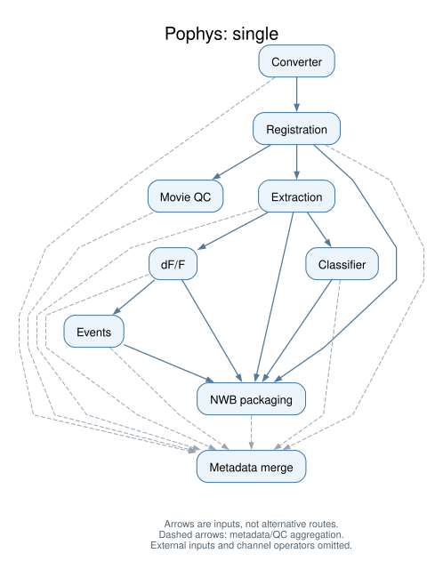

# Workflow previews

## Single-plane



[Open full-size SVG](single.svg)

## Multiplane


[Open full-size SVG](multiplane.svg)

The SVGs are top-down process dependency graphs. Each arrow is a separate input,
not an alternative route: decrosstalk requires pair definitions as well as movies.
Dashed arrows show metadata/QC fan-in to the aggregator. Other arrows may carry
scientific data, provenance, or both. External inputs are omitted.

<details>
<summary>Raw Nextflow DAGs and generation details</summary>

Generated from the actual `pipeline/main.nf` using Nextflow 24.10.4 `-preview`.
Single-plane selects nine processes; multiplane selects eleven, including the
splitter and decrosstalk. No processing tasks execute. Placeholder paths are isolated
under `.image-work/diagrams/preview`; no scientific data or cloud mounts are used.

The raw `.mmd` files retain channel/operator nodes. `.display.mmd` files change only
process labels. The generator collapses paths through operators, stopping at each
process, then renders the resulting `.dot` graph with Graphviz. No process-to-process
edges are removed, including direct movie inputs alongside pair-splitting outputs.
These are not per-plane task traces or all-branches control-flow diagrams.
`provenance.json` records the source hash and generator versions.

[Single-plane raw DAG](single.mmd) | [Multiplane raw DAG](multiplane.mmd)

These raw files render all channel nodes on GitHub and are deliberately not the
reader-facing diagrams.

With Java 17+, uv and Graphviz (`dot`, rendered here with version 16.0.0) available,
run from the pipeline repository:

```bash
mkdir -p .image-work/diagrams
curl -fL https://github.com/nextflow-io/nextflow/releases/download/v24.10.4/nextflow-24.10.4-dist \
  -o .image-work/diagrams/nextflow
chmod +x .image-work/diagrams/nextflow
uv run --python 3.12 --no-project scripts/render-diagrams.py \
  --nextflow .image-work/diagrams/nextflow
```

Optionally pass `--docs-output /path/to/aind-software-docs/docs/source/_static/pophys`
to refresh the embedded documentation copies.

</details>
